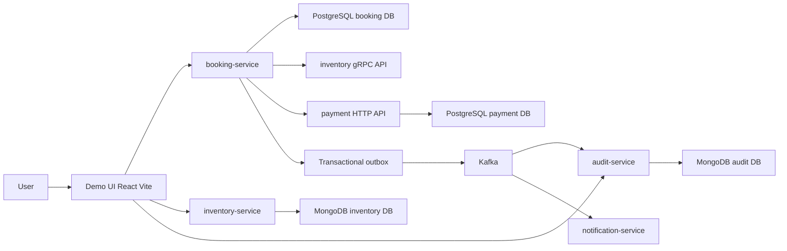
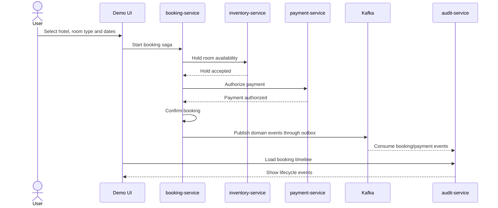
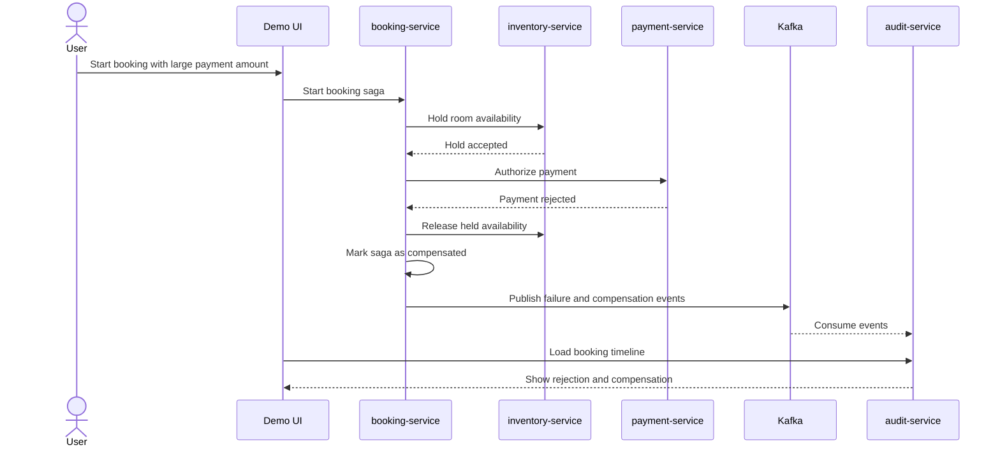

# Hotel Booking — Production-Style Java Backend Portfolio Project

Hotel Booking is a production-style Java backend portfolio project that demonstrates how a distributed booking platform can be designed around clear service boundaries, transactional consistency, asynchronous integration, security, and observability.

The project is intentionally focused on backend engineering. The React Demo UI is a thin client used to demonstrate the business flow: inventory setup, room availability, booking saga, payment authorization, audit timeline, and booking cancellation.

## What this project demonstrates

- Clean Architecture / Hexagonal Architecture
- Domain-Driven Design basics: aggregates, value objects, invariants, use cases, ports and adapters
- Multi-module Gradle project structure
- PostgreSQL persistence for transactional business state
- MongoDB persistence for document-oriented projections and notification/audit data
- Kafka-based asynchronous integration
- Transactional outbox pattern
- gRPC service-to-service communication
- HTTP integration between services
- Orchestration saga with compensation and retry
- Comparison of handmade orchestration and Spring Statemachine prototype
- Service-level integration testing with Testcontainers
- Concurrency protection for finite inventory
- Local observability: Actuator, MDC logs, correlation IDs, Micrometer metrics
- GitHub Actions CI
- Demo UI application with Google JWT authentication mode

## System overview



The main flow starts in `booking-service`, but the booking decision depends on several independent capabilities:

- `inventory-service` checks and reserves finite room availability.
- `payment-service` authorizes or rejects payment.
- `audit-service` builds an event timeline from Kafka events.
- `notification-service` demonstrates asynchronous side effects.
- `Demo UI` provides a readable end-to-end scenario for interviews and local demos.

## Services

| Service | Responsibility | Main technologies |
|---|---|---|
| `booking-service` | Booking aggregate, booking saga orchestration, cancellation, outbox publishing | Spring Boot, PostgreSQL, Kafka, gRPC client, JWT |
| `inventory-service` | Hotels, room types, availability, finite inventory reservation | Spring Boot, MongoDB, gRPC |
| `payment-service` | Fake payment provider, authorization, rejection scenario | Spring Boot, PostgreSQL, HTTP |
| `audit-service` | Event timeline projection for booking/payment events | Spring Boot, Kafka consumer, MongoDB |
| `notification-service` | Asynchronous notification task handling | Spring Boot, Kafka consumer |
| `apps/demo-ui` | Thin demo client for the end-to-end flow | React, Vite, TypeScript, Google Identity Services |

## Booking happy path



Expected result:

- booking status becomes `CONFIRMED`
- inventory is held/booked according to the saga step
- payment authorization is linked to the booking
- audit timeline shows the lifecycle events
- correlation IDs allow the flow to be traced in logs

## Payment rejection and compensation flow

The fake payment provider intentionally rejects large payments. In the local demo, a payment amount greater than `50000` demonstrates the compensation scenario.



Expected result:

- saga status becomes `COMPENSATED`
- booking is not confirmed
- held inventory is released
- audit timeline explains what happened
- logs contain the same correlation context for troubleshooting

## Local demo scenario

Before running the demo, prepare the local environment.

### Required local ports

Make sure these ports are free:

| Component | Port |
|---|---:|
| `booking-service` HTTP API | `8080` |
| `inventory-service` HTTP API | `8081` |
| `notification-service` HTTP API | `8082` |
| `payment-service` HTTP API | `8083` |
| `audit-service` HTTP API | `8084` |
| `inventory-service` gRPC API | `9090` |
| Demo UI | `5173` |
| PostgreSQL | `5432` |
| MongoDB | `27017` |
| Kafka external listener | `9092` |
| Kafka UI | `8089` |

Kafka also uses internal Docker listeners such as `29092` and controller communication inside the Compose network. For normal local usage, the important host-facing ports are `9092` and `8089`.

### Start infrastructure

Start PostgreSQL, MongoDB, Kafka and Kafka UI:

```bash
docker compose up -d
```

Check containers:

```bash
docker compose ps
```

Kafka UI is available at:

```text
http://localhost:8089
```

### Generate local mTLS certificates

The project uses local mTLS certificates for the booking-service to inventory-service gRPC integration.

Generate certificates from the repository root:

```bash
bash scripts/generate-dev-mtls-certs.sh
```

Generated files are written to:

```text
certs/dev/
```

This step is usually needed once per local checkout, or after deleting the generated certificate files.

### Protocol Buffers and gRPC code generation

Manual protobuf generation is usually not required.

The `modules:inventory-grpc-api` module uses the Gradle protobuf plugin. Java and gRPC sources are generated automatically when Gradle compiles the module or dependent services.

Useful commands:

```bash
./gradlew :modules:inventory-grpc-api:generateProto
./gradlew :modules:inventory-grpc-api:compileJava
```

A normal service build also triggers the required generation:

```bash
./gradlew :apps:booking-service-app:compileJava
./gradlew :apps:inventory-service-app:compileJava
```

Generated sources are placed under the Gradle `build/generated` directory and should not be committed.

If the IDE does not see generated gRPC classes, re-import the Gradle project or run `compileJava` once.

### Load demo inventory data

Demo hotel and room availability can be created through the UI, but the fastest repeatable path is to load the MongoDB script.

Run from the repository root:

```bash
docker cp docker/mongo/init/demo-data.js hotelbooking-mongo:/tmp/demo-data.js
docker exec hotelbooking-mongo mongosh /tmp/demo-data.js
```

The script creates demo inventory in the Java/Spring Data Mongo UUID format used by the project.

The demo data uses future dates around:

```text
2030-06-11 .. 2030-06-20
```

### Start backend services

For the default Google-authenticated demo:

```text
booking-service:      dev-jwt
inventory-service:    dev
payment-service:      dev
audit-service:        dev
notification-service: dev
```

For simple demo-user mode without Google login:

```text
booking-service: dev
Demo UI:         VITE_AUTH_MODE=demo
```

The important rule is:

- Google UI mode requires JWT security on `booking-service`.
- Demo UI mode requires dev/demo security on `booking-service`.

### Start the Demo UI

```bash
cd apps/demo-ui
npm install
npm run dev
```

Open:

```text
http://localhost:5173
```

### Run the demo

1. Sign in with Google, or switch UI/backend to demo auth mode.
2. Open `Inventory Admin` and create demo inventory, or use the MongoDB demo script above.
3. Open `Hotels`.
4. Select a hotel and room type.
5. Check availability for the initialized dates.
6. Start booking saga with a normal payment amount.
7. Open `My bookings`.
8. Open audit timeline.
9. Cancel a booking if it is still cancellable.
10. Repeat with payment amount greater than `50000` to show payment rejection and compensation.

More detailed scenario:

- [`docs/DEMO_SCENARIO.md`](docs/DEMO_SCENARIO.md)
- [`apps/demo-ui/RUNBOOK.md`](apps/demo-ui/RUNBOOK.md)

## Authentication modes

The Demo UI supports two modes.

### Google JWT mode

This is the default portfolio mode.

```env
VITE_AUTH_MODE=google
VITE_GOOGLE_CLIENT_ID=your-google-client-id.apps.googleusercontent.com
```

In this mode:

- the UI obtains a Google ID token
- the UI sends it as `Authorization: Bearer <token>`
- `booking-service` validates the JWT
- the authenticated user is resolved from the token

The Google OAuth Client ID is public for browser applications. It is not a client secret.

The Google OAuth client must allow the local JavaScript origin:

```text
http://localhost:5173
```

If the UI is opened with another origin, for example `http://127.0.0.1:5173`, that origin must be added to the OAuth client too.

### Demo mode

Demo mode is useful for local backend testing without Google login.

Create a local override file:

```text
apps/demo-ui/.env.local
```

```env
VITE_AUTH_MODE=demo
```

In demo mode:

- the UI does not send an authorization header
- `booking-service` must run with the dev/demo security profile
- the current user is resolved as the configured demo user

## Local profile examples

Typical profile combinations:

| Use case | UI mode | booking-service profile |
|---|---|---|
| Google authenticated demo | `VITE_AUTH_MODE=google` | `dev-jwt` |
| Simple local demo user | `VITE_AUTH_MODE=demo` | `dev` |
| Local JWT without Kafka publishing | `VITE_AUTH_MODE=google` | `local-jwt` |
| Local dev with Kafka | `VITE_AUTH_MODE=demo` | `local-kafka` |

The exact run commands can depend on the IDE run configuration and local environment, but the important rule is simple:

- Google UI mode requires JWT security on the backend.
- Demo UI mode requires demo/dev security on the backend.

## Demo UI

The UI is intentionally thin. It is not the main architectural focus. Its purpose is to make the backend behavior visible.

It demonstrates:

- hotel catalog
- inventory admin operations
- availability check
- booking saga creation
- Google sign-in
- current user bookings
- audit timeline
- booking cancellation

UI docs:

- [`apps/demo-ui/README.md`](apps/demo-ui/README.md)
- [`apps/demo-ui/RUNBOOK.md`](apps/demo-ui/RUNBOOK.md)

## API examples

Backend API examples are documented separately:

- [`docs/API_EXAMPLES.md`](docs/API_EXAMPLES.md)

The examples are useful for reviewing the backend without using the UI.

## Architecture notes

Main architecture documents:

- [`docs/ARCHITECTURE.md`](docs/ARCHITECTURE.md)
- [`docs/diagrams/system-context.md`](docs/diagrams/system-context.md)
- [`docs/diagrams/booking-flow.md`](docs/diagrams/booking-flow.md)
- [`docs/diagrams/booking-saga.md`](docs/diagrams/booking-saga.md)
- [`docs/diagrams/outbox-kafka-audit.md`](docs/diagrams/outbox-kafka-audit.md)

Reference documentation:

- [`docs/reference/README.md`](docs/reference/README.md)

## Senior engineering topics

The project is designed to show senior backend topics in a compact but runnable form:

- service boundaries and ownership of data
- application layer use cases
- domain invariants
- persistence adapters
- synchronous and asynchronous integration
- eventual consistency
- saga orchestration
- compensation logic
- transactional outbox
- idempotent event handling
- finite inventory concurrency protection
- JWT/OIDC authentication
- observability and correlation IDs
- integration testing strategy
- local development with multiple services

More details:

- [`docs/SENIOR_TOPICS.md`](docs/SENIOR_TOPICS.md)
- [`docs/INTERVIEW_NOTES.md`](docs/INTERVIEW_NOTES.md)

## Known trade-offs

This is a portfolio backend project, not a commercial booking product. Some choices are intentionally simplified so the system stays runnable locally and explainable during interviews.

Examples:

- the Demo UI is a thin client, not a full product frontend
- payment provider is fake and deterministic
- notification delivery is simplified for local development
- Google authentication is used as a practical JWT/OIDC demo
- Spring Statemachine is included as a comparison/prototype, not the only saga implementation
- Kubernetes and production deployment hardening are outside the current release scope

More details:

- [`docs/TRADE_OFFS.md`](docs/TRADE_OFFS.md)

## CI

The project includes GitHub Actions CI to keep the codebase buildable and testable as the portfolio evolves.

## Release status

Current portfolio release target:

```text
v1.0.0 — Portfolio Release
```

The focus of this release is not adding more backend features, but making the existing architecture clear, readable and easy to review from a GitHub link.
