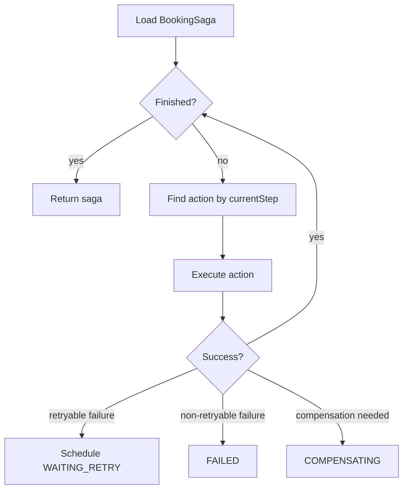
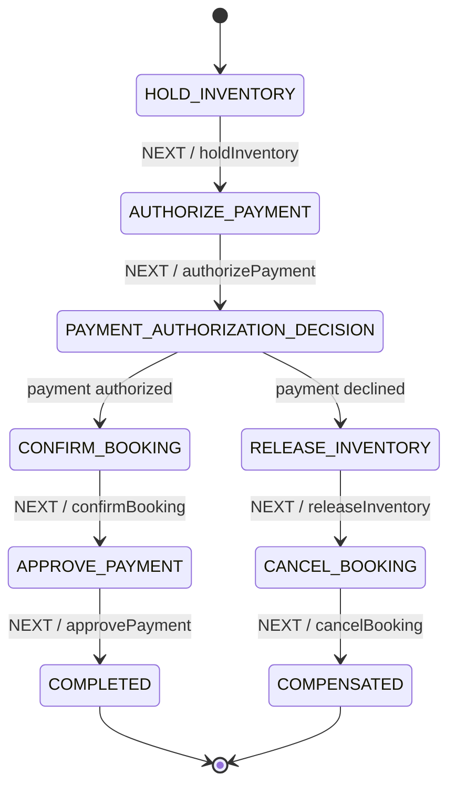
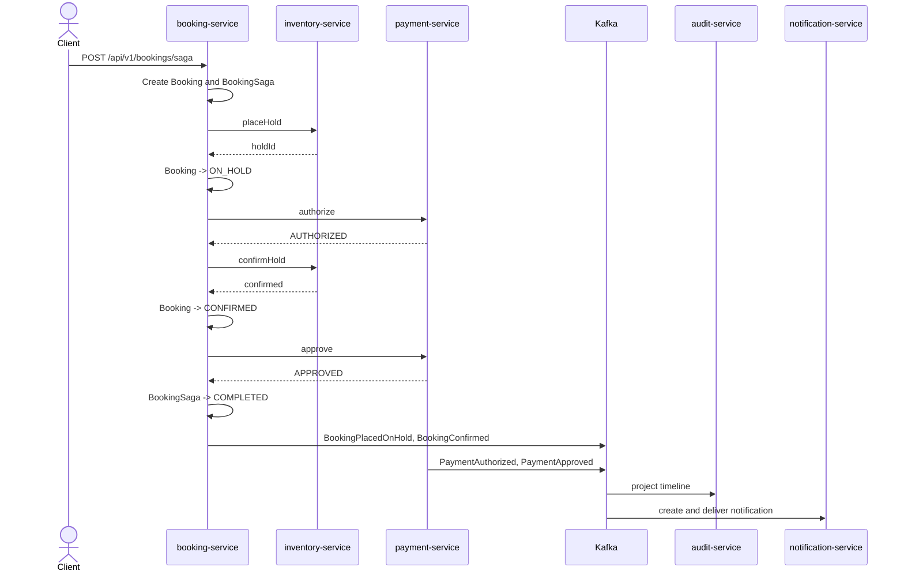
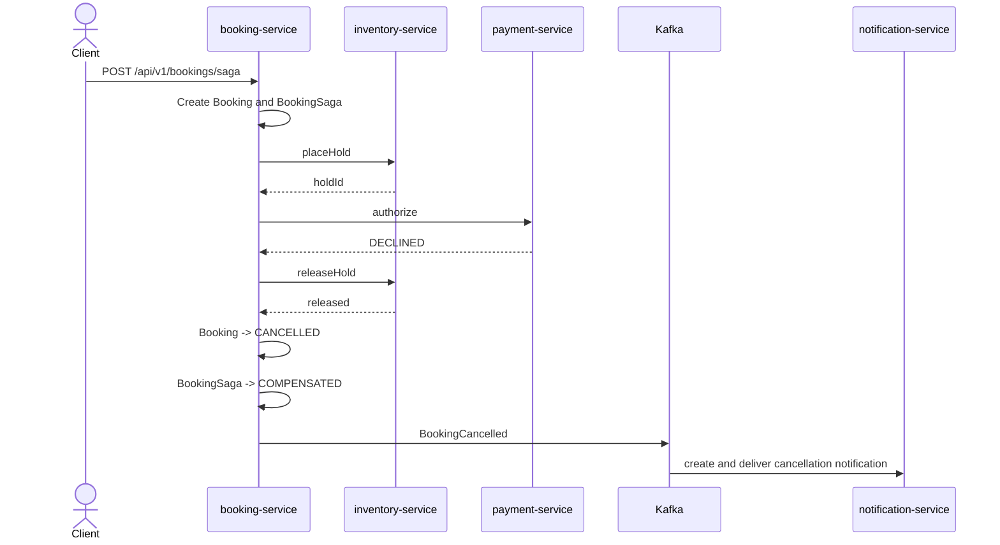

# Booking Saga Orchestration

Current milestone: `v0.14.0`.

This document describes the booking saga flow and the two available orchestration implementations:

1. Handmade process manager.
2. Spring Statemachine comparison prototype.

The handmade process manager is the default production-like implementation. The Spring Statemachine endpoint exists to compare orchestration styles while reusing the same business actions.

## Why booking saga exists

Booking creation touches multiple services and databases:

| Area | Service | Storage |
|---|---|---|
| Booking state | booking-service | PostgreSQL |
| Inventory hold/reservation | inventory-service | MongoDB |
| Payment state | payment-service | PostgreSQL |
| Notification task | notification-service | MongoDB |
| Timeline projection | audit-service | MongoDB |

There is no distributed ACID transaction across these services.

The saga coordinates the process through:

- local transactions
- external service calls
- durable saga state
- retryable steps
- compensation steps
- transactional outbox events

## Endpoints

| Endpoint | Implementation | Purpose |
|---|---|---|
| `POST /api/v1/bookings/saga` | Handmade process manager | main booking saga endpoint |
| `POST /api/v1/bookings/saga-statemachine` | Spring Statemachine | comparison and learning endpoint |

In local demo runs, both endpoints can be enabled through the `dev` profile group.

## Shared saga actions

Both implementations reuse the same action classes:

- `HoldInventorySagaAction`
- `AuthorizePaymentSagaAction`
- `ConfirmBookingSagaAction`
- `ApprovePaymentSagaAction`
- `CancelPaymentSagaAction`
- `ReleaseInventorySagaAction`
- `CancelBookingSagaAction`

This avoids duplicating business step logic. The comparison is about orchestration style, not different business behavior.

## Handmade process manager

Main classes:

```text
StartBookingSagaService
BookingSagaProcessManager
BookingSagaActionRegistry
BookingSagaAction classes
BookingSagaRetryScheduler
```

The process manager explicitly controls:

- loading persisted saga state
- executing the current step
- detecting retryable failures
- scheduling retries
- deciding when compensation should start
- moving to terminal states

Simplified model:



Strengths:

- explicit Java code
- simple to debug
- no additional orchestration framework
- retry and compensation behavior is visible
- easy to explain transaction boundaries

Trade-offs:

- custom orchestration code must be maintained
- complex workflows can become harder to visualize as code grows
- no built-in workflow history UI

## Spring Statemachine comparison prototype

Main classes:

```text
StartSpringStatemachineBookingSagaService
SpringStatemachineBookingSagaService
SpringStatemachineBookingSagaConfig
SpringStatemachineBookingSagaActions
```

The prototype uses:

- states
- transitions
- guards
- actions
- a decision state for payment authorization result

Simplified state model:



Strengths:

- flow structure is visible as states and transitions
- branching can be expressed with guards/choice states
- useful for comparing workflow styles
- reuses the same saga actions as the handmade implementation

Trade-offs:

- adds framework complexity
- action/guard execution can be less obvious than a simple loop
- durable workflow history still has to be implemented explicitly
- not a replacement for a full workflow engine such as Temporal

## Happy path



Final state:

| Component | State |
|---|---|
| Booking | `CONFIRMED` |
| BookingSaga | `COMPLETED` |
| Payment | `APPROVED` |
| Inventory | confirmed reservation |
| Notification | confirmation notification sent |

## Payment declined compensation path



Final state:

| Component | State |
|---|---|
| Booking | `CANCELLED` |
| BookingSaga | `COMPENSATED` |
| Payment | `DECLINED` |
| Inventory | hold released |
| Notification | cancellation notification sent |

## Retry behavior

Retryable failures include technical failures from external integrations such as inventory or payment calls.

When a retryable failure happens and retry attempts remain:

```text
current step fails
  -> saga status WAITING_RETRY
  -> nextAttemptAt is set
  -> retry scheduler later resumes processing
```

When retry attempts are exhausted, the saga either starts compensation or fails depending on the current step.

## Transaction boundaries

The saga intentionally does not wrap the whole distributed operation in one local transaction.

Instead:

- local booking state changes are persisted transactionally
- outbox rows are written in the same local transaction as booking state changes
- external service calls happen outside local database transactions
- retry and compensation handle failures across service boundaries

This is the core reason for using a saga.

## Outbox integration

Booking lifecycle events are not published directly inside the business transaction.

Flow:

```text
booking state change
  + booking_outbox insert
  -> commit PostgreSQL transaction
  -> scheduler claims outbox message
  -> Kafka publisher sends event
  -> outbox row marked PUBLISHED
```

This protects local consistency between booking state and integration event intent.

## Observability

Both saga implementations write MDC context:

```text
ctx[corr=... saga=... booking=... payment=... event=... type=...]
```

During saga execution, the important fields are:

```text
corr
saga
booking
payment when available
```

Outbox publishing later uses:

```text
corr
booking
event
type
```

Custom booking metrics include:

```text
hotelbooking.booking.saga.processed
hotelbooking.booking.saga.retry.scheduled
hotelbooking.booking.outbox.published
hotelbooking.booking.outbox.publication.failed
```

The `implementation` metric tag distinguishes:

```text
handmade
spring-statemachine
```

