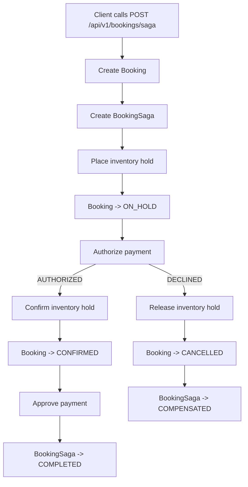
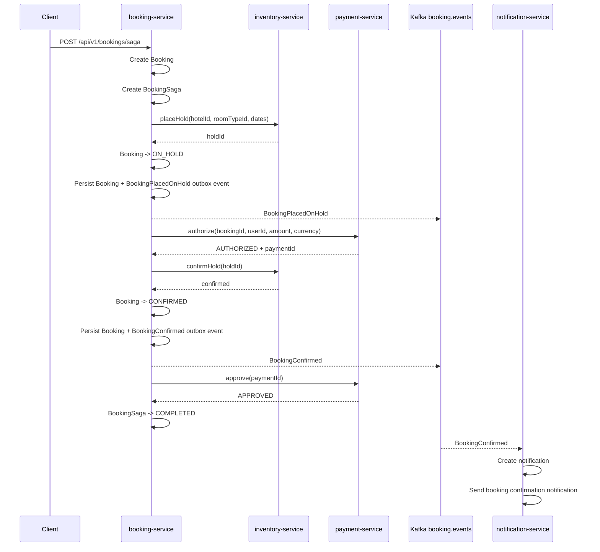
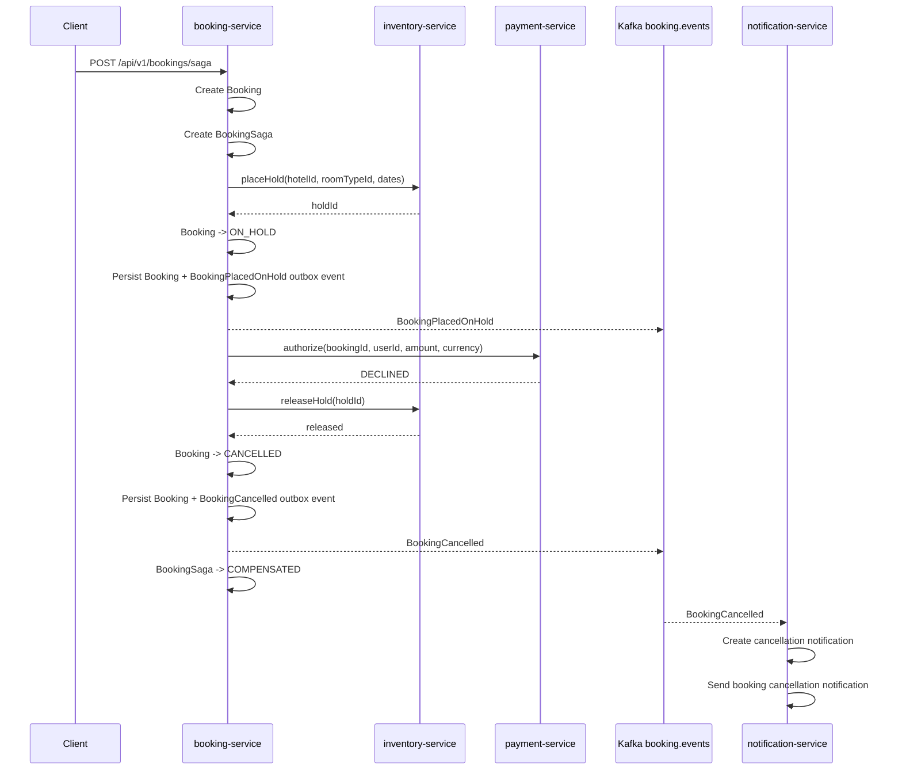
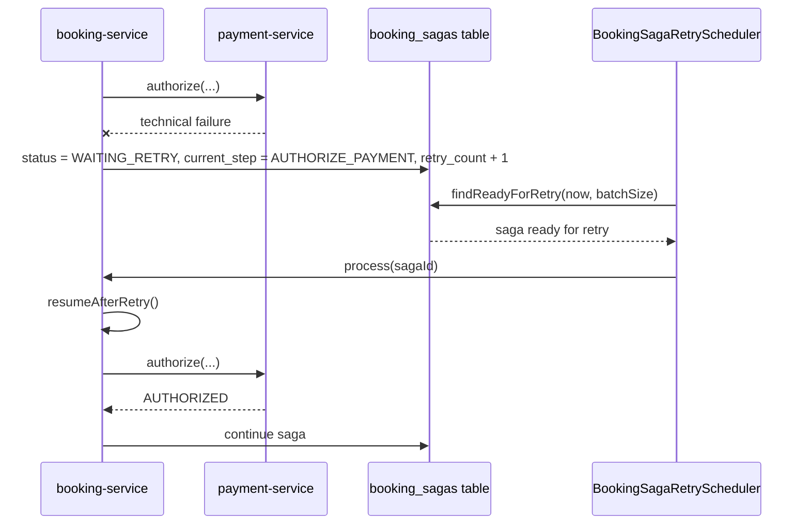
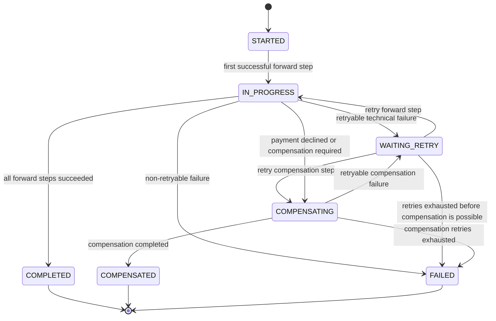
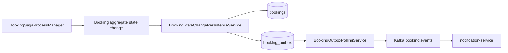

# Booking Saga Orchestration

## Overview

Booking service uses an orchestrated saga to coordinate the booking flow across several independent services:

- `booking-service`
- `inventory-service`
- `payment-service`
- `notification-service` through Kafka booking events

The saga is implemented as an explicit process manager inside `booking-service`.

The goal is to avoid distributed ACID transactions while keeping the process recoverable through local transactions, retries, idempotent operations, and compensation steps.

## Why saga is needed

The booking flow touches several bounded contexts and storages:

| Responsibility | Owner | Storage |
|---|---|---|
| Booking state | `booking-service` | PostgreSQL database `hotelbooking` |
| Inventory hold / reservation | `inventory-service` | MongoDB |
| Payment state | `payment-service` | PostgreSQL database `hotelbooking_payment` |
| Notification preferences and delivery | `notification-service` | MongoDB database `hotelbooking_notification` |

There is no distributed transaction across PostgreSQL, MongoDB, Kafka, and remote service calls.

Instead, each service performs its own local transaction, and `booking-service` coordinates the overall process through a saga.

## High-level flow

The saga follows this idea:

1. Create local booking and saga state.
2. Temporarily hold inventory.
3. Authorize payment.
4. Confirm the inventory hold.
5. Confirm the booking.
6. Approve payment.
7. Publish booking events through the booking outbox.
8. Notification service consumes booking events and sends notifications.

The process is not a distributed 2PC transaction. It is a saga with explicit forward steps and explicit compensation steps.

## Happy path

Successful booking creation uses two inventory steps and two payment steps.

Inventory:

| Step | Meaning |
|---|---|
| `placeHold` | Temporarily holds the room while payment is being checked |
| `confirmHold` | Converts the temporary hold into a confirmed reservation |

Payment:

| Step | Meaning |
|---|---|
| `authorize` | Checks that payment can be made and reserves the ability to pay |
| `approve` | Finalizes payment after inventory and booking are confirmed |

Final state:

| Entity | Final state |
|---|---|
| Booking | `CONFIRMED` |
| BookingSaga | `COMPLETED` |
| Payment | `APPROVED` |
| Inventory | confirmed reservation |
| Notification | booking confirmation notification created and sent |

## Payment declined compensation path

If payment authorization is declined, this is a business outcome, not a technical error.

The saga does not retry a declined payment. It compensates the already completed inventory hold.

Final state:

| Entity | Final state |
|---|---|
| Booking | `CANCELLED` |
| BookingSaga | `COMPENSATED` |
| Payment | `DECLINED` |
| Inventory | hold released |
| Notification | booking cancellation notification created and sent |

## Retry path

The saga stores its current step and retry metadata in the `booking_sagas` table.

Retry-related fields:

| Field | Meaning |
|---|---|
| `status` | Current saga status |
| `current_step` | Step that should be executed or retried |
| `retry_count` | Number of already scheduled retries |
| `next_attempt_at` | Time when the saga can be retried |

When a retryable technical failure happens, the saga is moved to `WAITING_RETRY`.

Examples of retryable failures:

- `payment-service` temporarily unavailable
- `inventory-service` temporarily unavailable
- HTTP timeout
- gRPC timeout
- connection refused

Examples of non-retryable outcomes:

- payment declined by provider
- invalid booking state
- invalid domain transition
- non-existing booking

## Saga state machine

## Booking saga steps

| Step | Description |
|---|---|
| `HOLD_INVENTORY` | Places a temporary hold in `inventory-service` |
| `AUTHORIZE_PAYMENT` | Asks `payment-service` to authorize payment |
| `CONFIRM_BOOKING` | Confirms inventory hold and marks booking as confirmed |
| `APPROVE_PAYMENT` | Finalizes approved payment |
| `CANCEL_PAYMENT` | Cancels authorized payment during compensation |
| `RELEASE_INVENTORY` | Releases temporary hold or cancels confirmed reservation |
| `CANCEL_BOOKING` | Finalizes booking compensation |
| `COMPLETE` | Terminal saga step |

## Why payment has two steps

Payment is split into two stages:

| Step | Meaning |
|---|---|
| `authorize` | Checks and reserves the ability to pay |
| `approve` | Finalizes payment after inventory and booking are confirmed |

This reduces the risk of taking money before the room is actually confirmed.

If a later step fails after authorization, the saga can cancel the authorization instead of issuing a refund.

In the current implementation payment provider is fake, but the split is intentionally production-like.

## Why inventory has two steps

Inventory is also split into two stages:

| Step | Meaning |
|---|---|
| `placeHold` | Temporarily holds the room while payment is being authorized |
| `confirmHold` | Converts the temporary hold into a confirmed reservation |

If payment is declined, the temporary hold is released with `releaseHold`.

If inventory was already confirmed and a later step fails, the saga uses a stronger compensation operation: `cancelConfirmedReservation`.

## Booking outbox integration

Saga-driven booking state changes must go through the booking outbox-aware persistence boundary.

The saga must not update booking state through `BookingRepository.save(...)` directly when booking status changes.

Correct flow:

This ensures that saga-driven booking changes publish the same events as regular booking use cases.

Examples:

| Booking state change | Outbox event |
|---|---|
| Booking becomes `ON_HOLD` | `BookingPlacedOnHold` |
| Booking becomes `CONFIRMED` | `BookingConfirmed` |
| Booking becomes `CANCELLED` | `BookingCancelled` |

`notification-service` currently ignores unsupported intermediate events such as `BookingPlacedOnHold`, but creates notifications for supported business events such as `BookingConfirmed` and `BookingCancelled`.

## Error classification

The booking saga separates business outcomes from technical failures.

| Situation | Type | Saga behavior |
|---|---|---|
| Payment provider returns `DECLINED` | business outcome | compensate immediately |
| Inventory says room is not available | business failure | fail or compensate depending on current progress |
| Payment service is unavailable | retryable technical failure | schedule retry |
| Inventory service is unavailable | retryable technical failure | schedule retry |
| Domain invariant violation | programming/domain error | fail fast |

This avoids retrying known business decisions while still allowing recovery from temporary infrastructure failures.

## Manual verification

### Happy path

1. Start PostgreSQL, MongoDB, Kafka, `booking-service`, `inventory-service`, `payment-service`, and `notification-service`.
2. Send request to `POST /api/v1/bookings/saga` with payment amount below fake provider decline threshold.
3. Verify:
   - booking status is `CONFIRMED`
   - saga status is `COMPLETED`
   - payment status is `APPROVED`
   - `BookingPlacedOnHold` and `BookingConfirmed` are written to `booking_outbox`
   - `BookingConfirmed` is published to Kafka topic `booking.events`
   - `notification-service` creates and sends booking confirmation notification

### Payment declined path

1. Configure fake payment provider decline threshold.
2. Send request to `POST /api/v1/bookings/saga` with payment amount above threshold.
3. Verify:
   - booking status is `CANCELLED`
   - saga status is `COMPENSATED`
   - payment status is `DECLINED`
   - inventory hold is released
   - `BookingPlacedOnHold` and `BookingCancelled` are written to `booking_outbox`
   - `BookingCancelled` is published to Kafka topic `booking.events`
   - `notification-service` creates and sends booking cancellation notification

### Retry path

1. Stop `payment-service` or `inventory-service`.
2. Send request to `POST /api/v1/bookings/saga`.
3. Verify that saga moves to `WAITING_RETRY`.
4. Start the unavailable service again.
5. Wait for `BookingSagaRetryScheduler`.
6. Verify that saga resumes from the stored `current_step`.

## Current limitations

The current implementation is intentionally simple and educational.

Known limitations:

- automatic inventory hold expiration is not implemented yet
- cancellation after approved payment does not refund payment yet
- payment approval unknown outcome is not reconciled yet
- saga is a handmade process manager, not a workflow engine
- retry handling is basic and should be hardened before production use
- no distributed tracing across booking, inventory, payment, and notification services yet
- compensation failure requires operator attention after retries are exhausted

## Future improvements

Potential next improvements:

- add automatic inventory hold expiration
- add refund or reversal process for cancellation after approved payment
- add stronger idempotency keys for every external saga step
- add reconciliation job for unknown payment approval outcomes
- add metrics for saga status, retry count, compensation count, and failure count
- add distributed tracing correlation across services
- compare handmade process manager with workflow engines such as Temporal, Camunda, or Spring Statemachine
