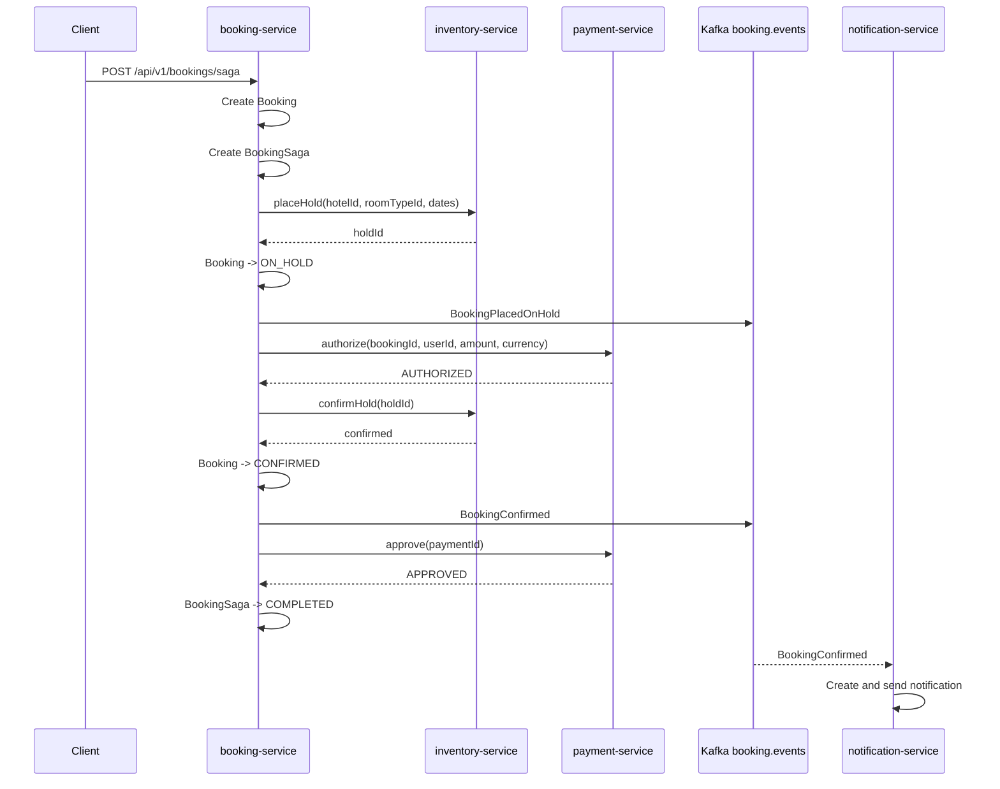
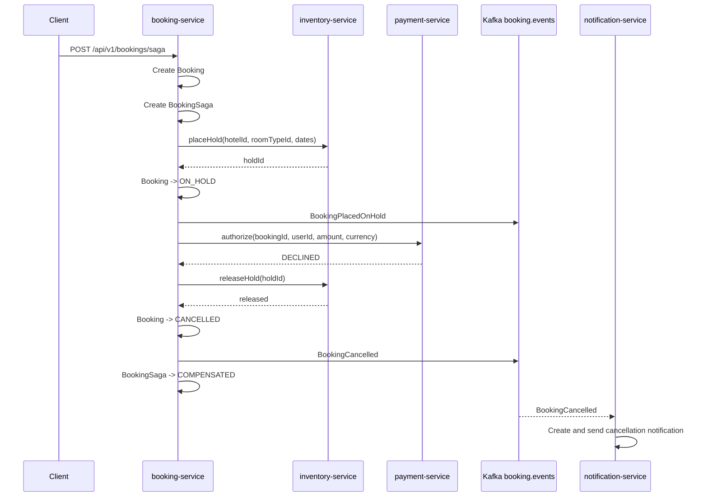
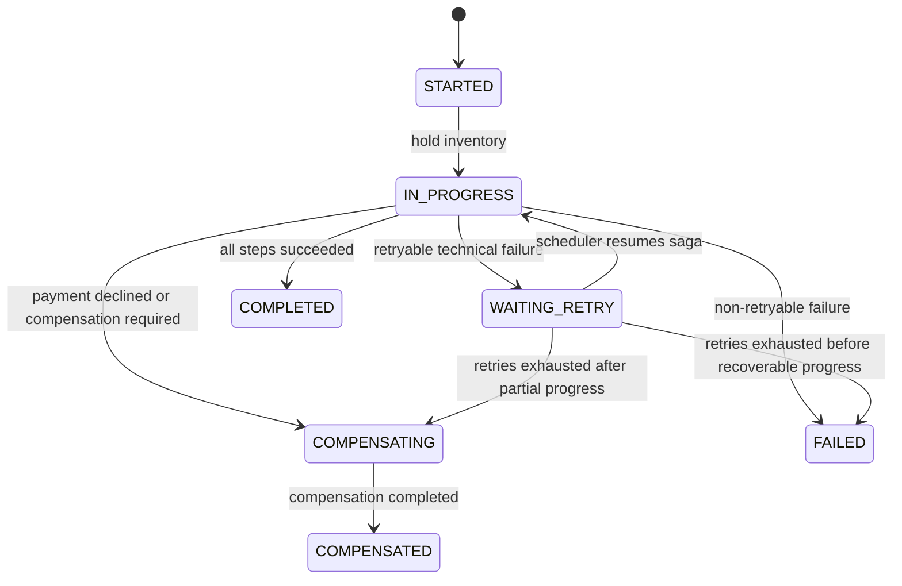
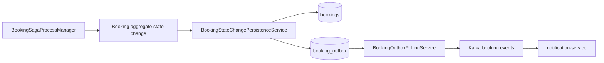

# Booking Saga Orchestration

## Overview

Booking service uses a simple orchestrated saga to coordinate the booking flow across several
independent services:

- booking-service
- inventory-service
- payment-service
- notification-service through Kafka booking events

The saga is implemented as an explicit process manager inside booking-service.

The goal is to avoid distributed ACID transactions and still keep the system recoverable through
local transactions, retries, and compensation steps.

## Why saga is needed

The booking flow touches multiple bounded contexts:

| Step | Owner | Storage |
|---|---|---|
| Booking state | booking-service | PostgreSQL |
| Inventory hold / reservation | inventory-service | MongoDB |
| Payment state | payment-service | PostgreSQL |
| Notification | notification-service | MongoDB |

There is no distributed transaction across these storages.

Instead, each service performs its own local transaction, and booking-service coordinates the
overall process through a saga.

## Happy path

Final state:

| Entity | Final state |
|---|---|
| Booking | CONFIRMED |
| BookingSaga | COMPLETED |
| Payment | APPROVED |
| Inventory | confirmed reservation |
| Notification | booking confirmation notification created |

## Payment declined compensation path

If payment authorization is declined, the saga compensates the already completed inventory hold.

Final state:

| Entity | Final state |
|---|---|
| Booking | CANCELLED |
| BookingSaga | COMPENSATED |
| Payment | DECLINED |
| Inventory | hold released |
| Notification | booking cancellation notification created |

## Retry path

The saga stores its current step and retry metadata in the `booking_sagas` table.

Retry-related fields:

| Field | Meaning |
|---|---|
| `status` | Current saga status |
| `current_step` | Step that should be retried |
| `retry_count` | Number of already scheduled retries |
| `next_attempt_at` | Time when the saga can be retried |

When a retryable technical failure happens, the saga is moved to `WAITING_RETRY`.

Examples of retryable failures:

- payment-service temporarily unavailable
- inventory-service temporarily unavailable
- HTTP/gRPC timeout
- connection refused

## Booking saga steps

| Step | Description |
|---|---|
| `HOLD_INVENTORY` | Places a temporary hold in inventory-service |
| `AUTHORIZE_PAYMENT` | Asks payment-service to authorize payment |
| `CONFIRM_BOOKING` | Confirms inventory hold and marks booking as confirmed |
| `APPROVE_PAYMENT` | Finalizes approved payment |
| `CANCEL_PAYMENT` | Cancels authorized payment during compensation |
| `RELEASE_INVENTORY` | Releases temporary hold or cancels confirmed reservation |
| `CANCEL_BOOKING` | Finalizes booking compensation |
| `COMPLETE` | Terminal saga step |

## Why payment has two steps

Payment is split into two stages:

| Step | Meaning |
|---|---|
| `authorize` | Checks and reserves the ability to pay |
| `approve` | Finalizes payment after inventory and booking are confirmed |

This reduces the risk of taking money before the room is actually confirmed.

If a later step fails after authorization, the saga can cancel the authorization instead of issuing a refund.

## Why inventory has two steps

Inventory is also split into two stages:

| Step | Meaning |
|---|---|
| `placeHold` | Temporarily holds the room while payment is being authorized |
| `confirmHold` | Converts the temporary hold into a confirmed reservation |

If payment is declined, the temporary hold is released.

If inventory was already confirmed and a later step fails, the saga uses a stronger compensation
operation: `cancelConfirmedReservation`.

## Booking outbox integration

Booking state changes made by the saga must go through the booking outbox-aware persistence boundary.

The saga must not update booking state through `BookingRepository.save(...)` directly when the
booking status changes.

Correct flow:

This ensures that saga-driven booking changes publish the same events as regular booking use cases.

## Current limitations

The current implementation is intentionally simple and educational.

Known limitations:

- automatic inventory hold expiration is not implemented yet
- cancellation after approved payment does not refund payment yet
- payment approval unknown outcome is not reconciled yet
- saga is a handmade process manager, not a workflow engine
- retry handling is basic and should be hardened before production use
- no distributed tracing across booking, inventory, payment, and notification services yet

## Manual verification

Happy path:

1. Start booking-service, inventory-service, payment-service, Kafka, PostgreSQL, MongoDB.
2. Send request to `POST /api/v1/bookings/saga` with payment amount below fake provider decline threshold.
3. Verify:
    - booking status is `CONFIRMED`
    - saga status is `COMPLETED`
    - payment status is `APPROVED`
    - `BookingConfirmed` is published to `booking.events`
    - notification-service sends booking confirmation notification

Payment declined path:

1. Configure fake payment provider decline threshold.
2. Send request to `POST /api/v1/bookings/saga` with payment amount above the threshold.
3. Verify:
    - booking status is `CANCELLED`
    - saga status is `COMPENSATED`
    - payment status is `DECLINED`
    - inventory hold is released
    - `BookingCancelled` is published to `booking.events`
    - notification-service sends booking cancellation notification