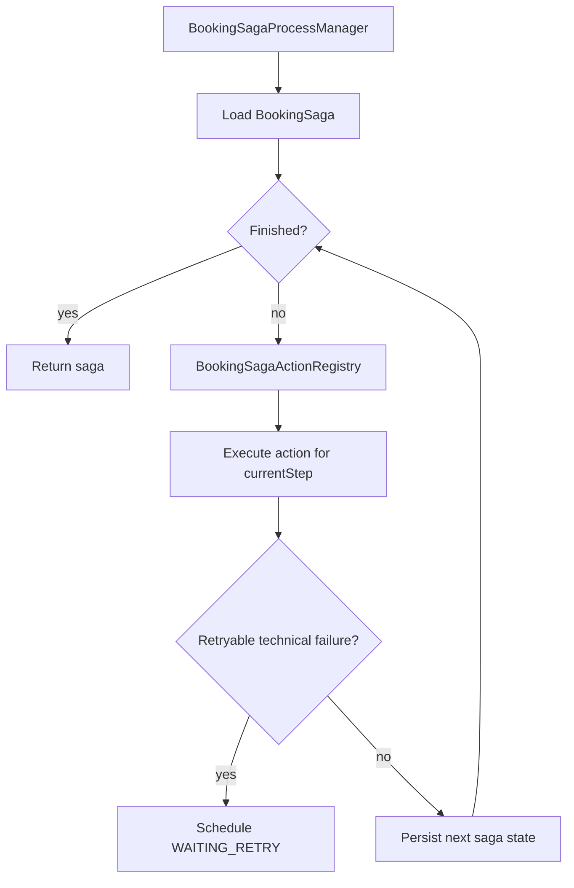
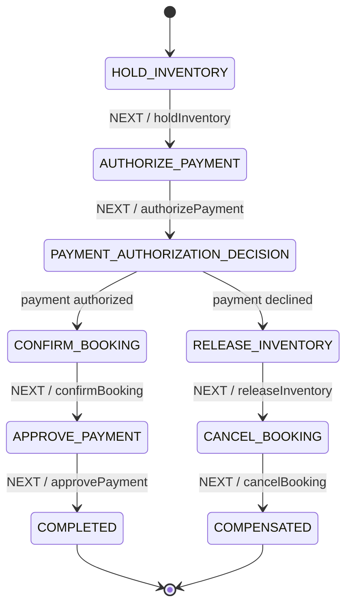
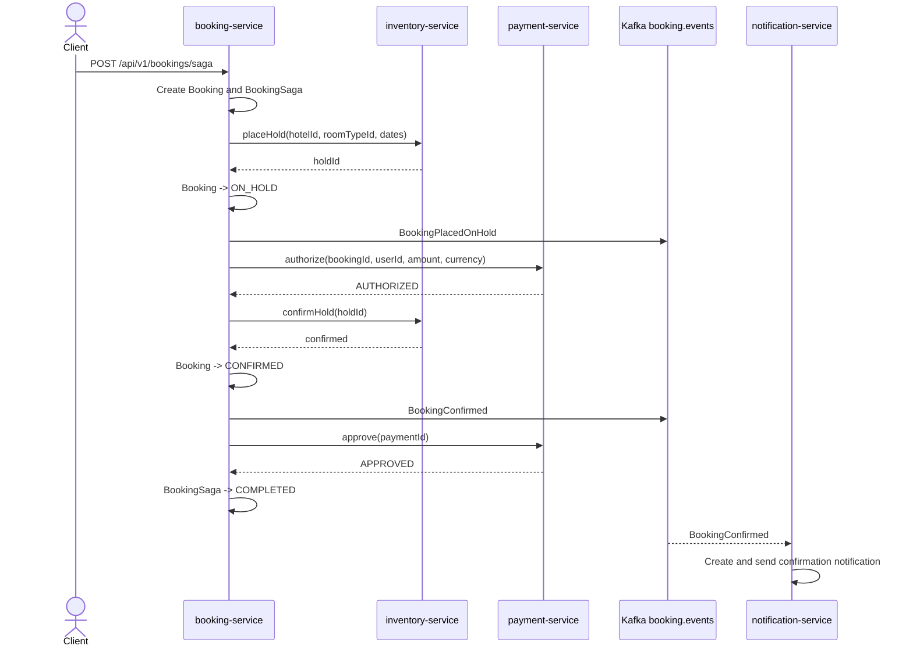
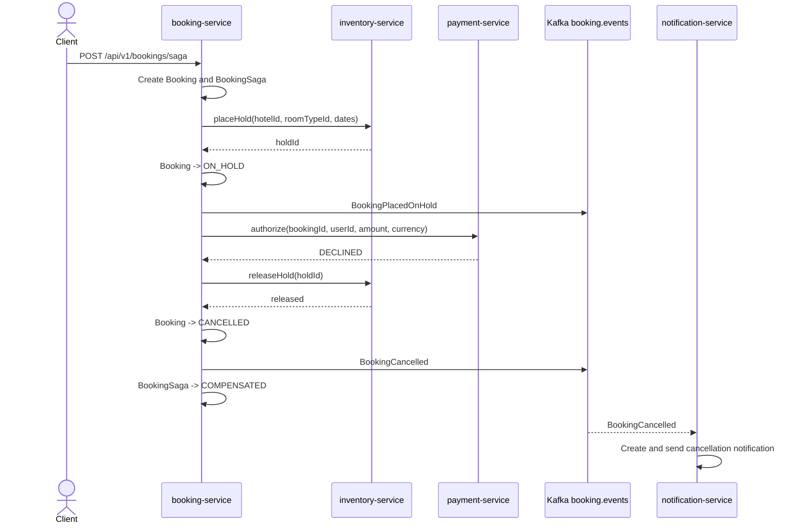
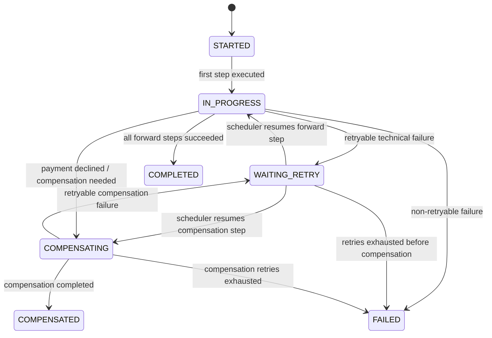
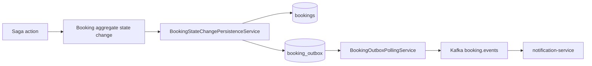

# Booking Saga Orchestration

Current milestone: `v0.11.0`.

This document describes the booking saga flow and the two available orchestration implementations:

1. Handmade process manager.
2. Spring Statemachine prototype.

The default production-like flow is still the handmade process manager.

## Why booking saga exists

Booking creation touches multiple services and databases:

| Area | Service | Storage |
|---|---|---|
| Booking state | booking-service | PostgreSQL |
| Inventory hold/reservation | inventory-service | MongoDB |
| Payment state | payment-service | PostgreSQL |
| Notification | notification-service | MongoDB |

There is no distributed ACID transaction across all services.

The saga coordinates the process through local transactions, retryable steps, and compensation.

## Endpoints

| Endpoint | Implementation | Availability |
|---|---|---|
| `POST /api/v1/bookings/saga` | Handmade process manager | default |
| `POST /api/v1/bookings/saga-statemachine` | Spring Statemachine prototype | only with profile `booking-saga-springstatemachine-prototype` |

## Shared saga actions

In `v0.11.0`, saga step logic was extracted into reusable action classes.

Both implementations reuse these actions:

- `HoldInventorySagaAction`
- `AuthorizePaymentSagaAction`
- `ConfirmBookingSagaAction`
- `ApprovePaymentSagaAction`
- `CancelPaymentSagaAction`
- `ReleaseInventorySagaAction`
- `CancelBookingSagaAction`

This means the comparison focuses on orchestration style, not duplicated business logic.

## Handmade process manager

The handmade process manager is implemented by:

```text
BookingSagaProcessManager
BookingSagaActionRegistry
BookingSagaAction classes
```

It owns:

- saga loop
- current step execution
- retry scheduling
- compensation decision
- exhausted retry handling

The process manager reads the persisted saga state and executes the action for the current step.



## Spring Statemachine prototype

The Spring Statemachine prototype is available only with profile:

```text
booking-saga-springstatemachine-prototype
```

Run example:

```bash
./gradlew :apps:booking-service-app:bootRun --args="--spring.profiles.active=local-kafka,booking-saga-springstatemachine-prototype"
```

Endpoint:

```http
POST /api/v1/bookings/saga-statemachine
```

The prototype uses:

- states
- transitions
- actions
- guards
- a choice-state for payment authorization decision

It is used for comparison and learning. It is not the default production-like flow.



## Happy path



Final state:

| Component | State |
|---|---|
| Booking | `CONFIRMED` |
| BookingSaga | `COMPLETED` |
| Payment | `APPROVED` |
| Inventory | confirmed reservation |
| Notification | confirmation notification sent |

## Payment declined compensation path



Final state:

| Component | State |
|---|---|
| Booking | `CANCELLED` |
| BookingSaga | `COMPENSATED` |
| Payment | `DECLINED` |
| Inventory | hold released |
| Notification | cancellation notification sent |

## Retry path

Retry is implemented in the handmade process manager.

Retry metadata is stored in `booking_sagas`:

| Field | Meaning |
|---|---|
| `status` | Current saga status |
| `current_step` | Step to retry |
| `retry_count` | Number of retries already scheduled |
| `next_attempt_at` | When retry can run |

Retryable errors include:

- payment-service temporary unavailability
- inventory-service temporary unavailability
- HTTP/gRPC timeout
- connection refused

Business decisions are not retried:

- payment declined
- invalid inventory request
- domain invariant violation



## Why payment has two steps

Payment is split into two operations:

| Step | Meaning |
|---|---|
| `authorize` | Check and reserve ability to pay |
| `approve` | Finalize payment after booking/inventory confirmation |

This prevents final payment approval before the room is confirmed.

If later steps fail after authorization but before approval, the saga can cancel the authorization instead of issuing a refund.

## Why inventory has two steps

Inventory is split into two operations:

| Step | Meaning |
|---|---|
| `placeHold` | Temporarily hold room while payment is authorized |
| `confirmHold` | Convert hold into confirmed reservation |

If payment is declined, the saga calls `releaseHold`.

If a reservation is already confirmed and a later step fails, the saga uses `cancelConfirmedReservation`.

## Booking outbox integration

Saga-driven booking state changes must use the outbox-aware persistence boundary.

Correct flow:



This ensures that saga-driven state changes produce the same booking events as regular booking use cases.

## Manual verification

### Handmade happy path

Endpoint:

```http
POST /api/v1/bookings/saga
```

Use payment amount below fake provider decline threshold.

Expected:

- booking `CONFIRMED`
- saga `COMPLETED`
- payment `APPROVED`
- `BookingConfirmed` event
- confirmation notification sent

### Handmade declined path

Endpoint:

```http
POST /api/v1/bookings/saga
```

Use payment amount above fake provider decline threshold.

Expected:

- booking `CANCELLED`
- saga `COMPENSATED`
- payment `DECLINED`
- inventory hold released
- `BookingCancelled` event
- cancellation notification sent

### Spring Statemachine prototype

Start with profile:

```bash
./gradlew :apps:booking-service-app:bootRun --args="--spring.profiles.active=local-kafka,booking-saga-springstatemachine-prototype"
```

Endpoint:

```http
POST /api/v1/bookings/saga-statemachine
```

Both happy path and declined path should produce the same business result as the handmade saga.

## Current limitations

- Spring Statemachine prototype is not the default flow.
- Spring Statemachine prototype is used for comparison and learning.
- Temporal is documented as a production-grade alternative but not implemented in code.
- Automatic inventory hold expiration is not implemented yet.
- Cancellation after already approved payment does not refund payment yet.
- Payment approval unknown outcome reconciliation is not implemented yet.
- Distributed tracing is not implemented yet.
