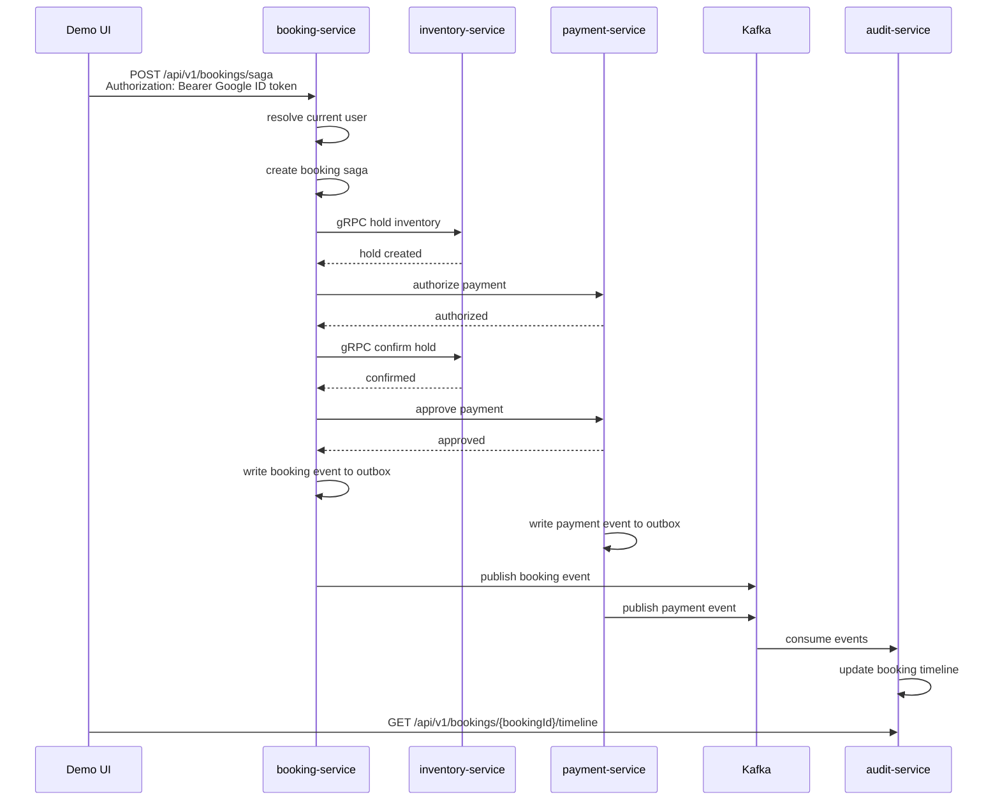

# Booking Flow Diagram

```mermaid
sequenceDiagram
    participant UI as Demo UI
    participant B as booking-service
    participant I as inventory-service
    participant P as payment-service
    participant K as Kafka
    participant A as audit-service

    UI->>B: POST /api/v1/bookings/saga<br/>Authorization: Bearer Google ID token
    B->>B: resolve current user
    B->>B: create booking saga
    B->>I: gRPC hold inventory
    I-->>B: hold created
    B->>P: authorize payment
    P-->>B: authorized
    B->>I: gRPC confirm hold
    I-->>B: confirmed
    B->>P: approve payment
    P-->>B: approved
    B->>B: write booking event to outbox
    P->>P: write payment event to outbox
    B->>K: publish booking event
    P->>K: publish payment event
    K->>A: consume events
    A->>A: update booking timeline
    UI->>A: GET /api/v1/bookings/{bookingId}/timeline
```

