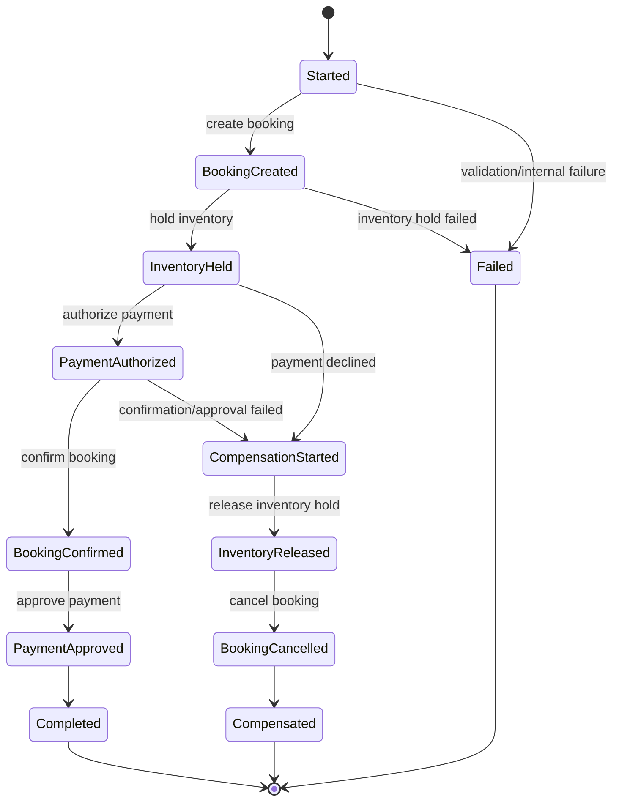

# Booking Saga Diagram

```mermaid
stateDiagram-v2
    [*] --> Started
    Started --> BookingCreated: create booking
    BookingCreated --> InventoryHeld: hold inventory
    InventoryHeld --> PaymentAuthorized: authorize payment
    PaymentAuthorized --> BookingConfirmed: confirm booking
    BookingConfirmed --> PaymentApproved: approve payment
    PaymentApproved --> Completed
    Completed --> [*]

    InventoryHeld --> CompensationStarted: payment declined
    PaymentAuthorized --> CompensationStarted: confirmation/approval failed
    CompensationStarted --> InventoryReleased: release inventory hold
    InventoryReleased --> BookingCancelled: cancel booking
    BookingCancelled --> Compensated
    Compensated --> [*]

    BookingCreated --> Failed: inventory hold failed
    Started --> Failed: validation/internal failure
    Failed --> [*]
```

## Compensation principle

Each step is committed locally. If a later step fails, the saga executes explicit compensation steps for already completed operations.

