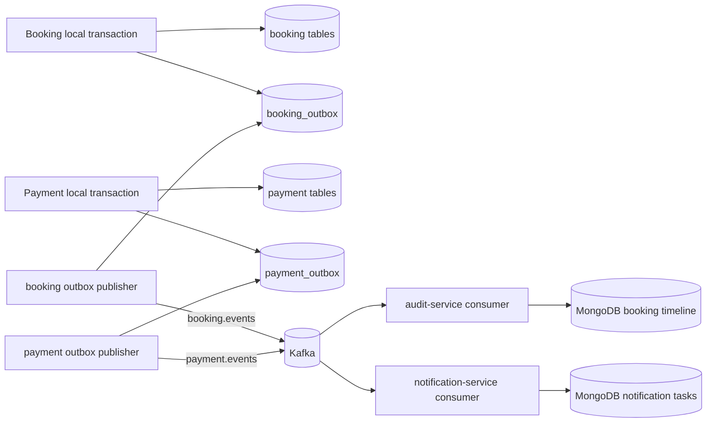

# Outbox, Kafka and Audit Timeline

## Why outbox is used

The outbox event is stored in the same local transaction as business state. This avoids the classic failure where the database commit succeeds but the application crashes before publishing the Kafka event.

