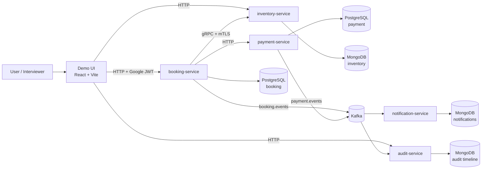

# System Context Diagram

## Notes

- Booking-service owns the main booking lifecycle.
- Inventory-service owns availability and finite room capacity.
- Payment-service owns payment authorization state.
- Kafka is used for asynchronous projections and side effects.
- Audit-service builds timeline read model from events.

