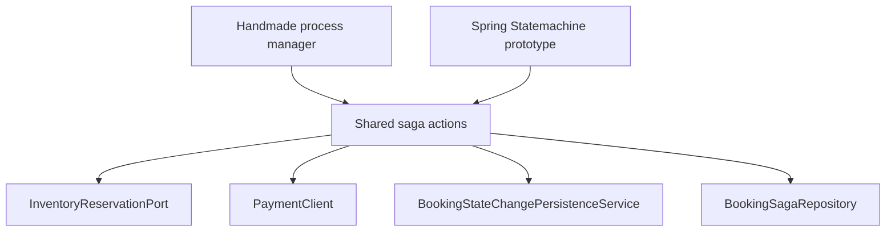

# Saga Orchestration Approaches Comparison

Current milestone: `v0.14.0`.

The project compares two implemented booking saga orchestration styles and one documented production-grade alternative.

Implemented:

1. Handmade process manager.
2. Spring Statemachine comparison prototype.

Documented but not implemented:

3. Temporal.

## Why compare approaches

The booking saga coordinates several services:

- booking-service
- inventory-service
- payment-service
- notification-service through Kafka events
- audit-service through Kafka events

The flow includes:

- forward steps
- compensation
- retry
- outbox publication
- downstream projections and notifications
- observability across service boundaries

This makes it a useful learning case for comparing orchestration styles.

## Shared action design

Both implemented orchestrators reuse the same saga actions:

- `HoldInventorySagaAction`
- `AuthorizePaymentSagaAction`
- `ConfirmBookingSagaAction`
- `ApprovePaymentSagaAction`
- `CancelPaymentSagaAction`
- `ReleaseInventorySagaAction`
- `CancelBookingSagaAction`



This keeps the comparison fair: the business step logic is the same, while orchestration style differs.

## Approach 1: Handmade process manager

Endpoint:

```http
POST /api/v1/bookings/saga
```

Main classes:

```text
StartBookingSagaService
BookingSagaProcessManager
BookingSagaActionRegistry
BookingSagaRetryScheduler
```

The handmade process manager explicitly controls:

- loading saga state
- executing current step
- retry handling
- compensation decision
- terminal state handling
- metrics and logs around saga outcomes

Strengths:

- very explicit and easy to debug
- no additional orchestration framework
- retry/compensation logic is visible
- transaction boundaries are easy to explain
- suitable for the current size of the workflow

Weaknesses:

- custom orchestration code must be maintained
- visualization must be documented separately
- complex workflows may become harder to manage as plain Java flow grows
- no built-in workflow history UI

## Approach 2: Spring Statemachine comparison prototype

Endpoint:

```http
POST /api/v1/bookings/saga-statemachine
```

Main package:

```text
com.example.hotelbooking.booking.application.saga.springstatemachine
```

The prototype uses:

- states
- transitions
- events
- guards
- actions
- a decision state

Strengths:

- flow structure is visible as a state model
- branching can be expressed declaratively
- useful for learning and comparison
- shared actions avoid duplicate business logic
- metrics and logs can be aligned with the handmade implementation

Weaknesses:

- adds framework complexity
- action and guard execution order needs careful understanding
- still requires explicit persistence and retry strategy
- does not automatically provide durable workflow history
- may be more complex than necessary for a small workflow

## Approach 3: Temporal

Temporal is not implemented in this repository.

It is documented as a production-grade workflow engine option for more complex distributed workflows.

Potential strengths:

- durable workflow execution history
- built-in retries and timers
- workflow visibility
- better support for long-running workflows
- strong operational model for complex orchestration

Potential trade-offs:

- additional infrastructure
- new programming model
- operational learning curve
- may be too heavy for this educational milestone

## Current project decision

Current decision:

```text
Use handmade process manager as the main implementation.
Keep Spring Statemachine as a comparison prototype.
Document Temporal as a future option, not as current infrastructure.
```

Reasoning:

- the handmade process manager is easiest to explain and debug
- the state machine prototype demonstrates a framework-based alternative
- both implementations share business actions
- the project remains understandable for interview discussion
- additional workflow infrastructure is not needed for the current milestone

## Observability comparison

Both implementations should produce comparable observability signals:

```text
ctx[corr=... saga=... booking=...]
hotelbooking.booking.saga.processed{implementation=...}
```

Metric tag values:

```text
implementation=handmade
implementation=spring-statemachine
```

This allows the same demo flow to compare both implementations without changing downstream services.

## Interview angle

A useful way to explain this part of the project:

```text
The project does not claim that one orchestration style is always better. It implements the same booking saga through two approaches and keeps the business actions shared. This makes the trade-off concrete: explicit Java control flow is simple and transparent, while a state machine makes the state model visible but adds framework complexity. Temporal is documented as a future option when workflow durability and operational tooling become more important than keeping the local demo lightweight.
```

