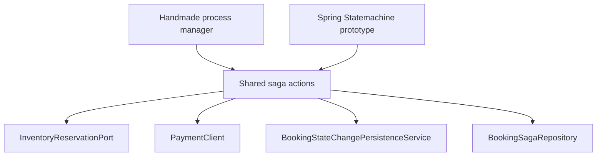
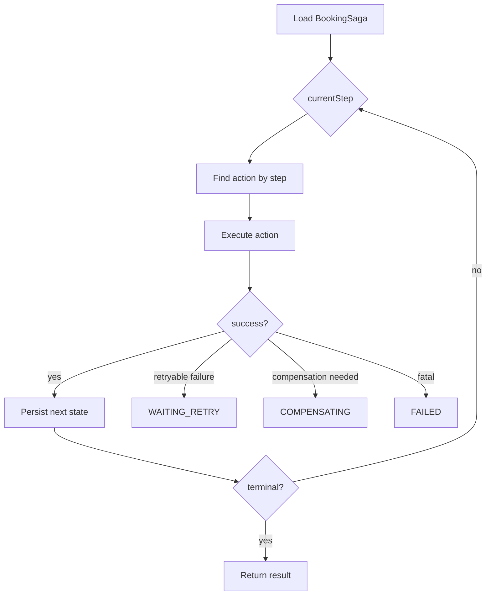
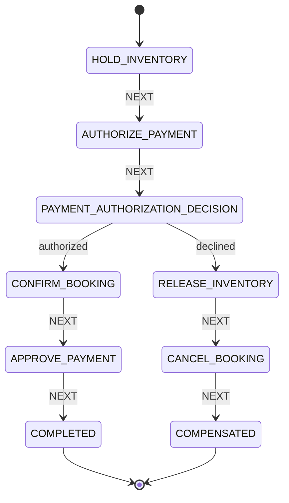

# Saga Orchestration Approaches Comparison

Current milestone: `v0.11.0`.

The project compares two implemented booking saga orchestration styles and one documented production-grade alternative.

Implemented:

1. Handmade process manager.
2. Spring Statemachine prototype.

Documented but not implemented:

3. Temporal.

## Why compare approaches

The booking saga coordinates several services:

- booking-service
- inventory-service
- payment-service
- notification-service through Kafka events

The flow includes:

- forward steps
- compensation
- retry
- event publication
- user notification

This makes it a good learning case for comparing orchestration styles.

## Shared action design

Before adding Spring Statemachine, saga step logic was extracted into action classes:

- `HoldInventorySagaAction`
- `AuthorizePaymentSagaAction`
- `ConfirmBookingSagaAction`
- `ApprovePaymentSagaAction`
- `CancelPaymentSagaAction`
- `ReleaseInventorySagaAction`
- `CancelBookingSagaAction`

This allows multiple orchestrators to reuse the same business step implementation.



## Approach 1: Handmade process manager

Default endpoint:

```http
POST /api/v1/bookings/saga
```

Main classes:

```text
BookingSagaProcessManager
BookingSagaActionRegistry
BookingSagaAction classes
BookingSagaRetryScheduler
```

The handmade process manager explicitly controls:

- loading saga state
- executing current step
- retry handling
- compensation decision
- exhausted retry behavior
- terminal state handling

Simplified model:



### Strengths

- Very explicit and easy to debug.
- No additional orchestration framework.
- Retry/compensation code is visible.
- Good for learning distributed transaction replacement.
- Easy to explain transaction boundaries.

### Weaknesses

- Flow is implemented in Java code.
- More custom logic to maintain.
- Complex workflows may become harder to visualize.
- No built-in workflow history UI.
- No built-in timers/retry DSL.

## Approach 2: Spring Statemachine prototype

Prototype endpoint:

```http
POST /api/v1/bookings/saga-statemachine
```

Required profile:

```text
booking-saga-springstatemachine-prototype
```

Main package:

```text
com.example.hotelbooking.booking.application.saga.springstatemachine
```

The prototype uses:

- states
- transitions
- events
- guards
- actions
- choice-state

Simplified state model:



### Strengths

- Flow structure is visible as states and transitions.
- Guards and choice-states make branching explicit.
- Shared actions avoid duplicating business logic.
- Useful for comparing orchestration styles.
- Good fit for medium-complexity stateful flows inside Spring.

### Weaknesses

- Adds framework complexity.
- Guards/actions order can be non-obvious.
- State machine does not automatically solve durable workflow history.
- Retry/durability still require explicit persistence strategy.
- More difficult to debug than a simple Java loop for small workflows.

### Important lesson from implementation

A direct guarded transition from `AUTHORIZE_PAYMENT` to `CONFIRM_BOOKING` did not work as expected because guards are evaluated before transition actions.

The fix was to introduce a choice-state:

```text
AUTHORIZE_PAYMENT
  -> action authorizePayment
  -> PAYMENT_AUTHORIZATION_DECISION
       -> CONFIRM_BOOKING if authorized
       -> RELEASE_INVENTORY if declined
```

This is a useful interview point: framework semantics matter.

## Approach 3: Temporal

Temporal is not implemented in code in `v0.11.0`.

It is documented as a production-grade workflow alternative.

Temporal would introduce:

- workflow definitions
- activities
- workers
- durable execution history
- built-in retry policies
- timers
- workflow visibility
- separate workflow runtime infrastructure

Possible Temporal model:

```text
BookingWorkflow
  -> HoldInventoryActivity
  -> AuthorizePaymentActivity
  -> ConfirmInventoryActivity
  -> ConfirmBookingActivity
  -> ApprovePaymentActivity
  -> Compensation activities on failure
```

### Strengths

- Durable workflow execution.
- Built-in history and visibility.
- Strong retry/timer support.
- Better for long-running business processes.
- Worker/activity model separates workflow from side effects.

### Weaknesses

- Requires Temporal server/dev server.
- Requires workers.
- Introduces a different programming model.
- More infrastructure to run locally and in production.
- Too much for the current educational milestone.

## Comparison table

| Feature | Handmade process manager | Spring Statemachine prototype | Temporal |
|---|---|---|---|
| Implemented in project | yes | yes, prototype | no |
| Default booking flow | yes | no | no |
| Requires extra infrastructure | no | no | yes |
| Uses shared saga actions | yes | yes | would use activities instead |
| Durable saga state | yes, via `booking_sagas` | yes, via existing saga state | yes, workflow history |
| Built-in retry engine | no | limited/no | yes |
| Visual workflow model | manual diagrams | states/transitions | Temporal UI/history |
| Best use | explicit learning baseline | state-machine comparison | production durable workflows |

## Current project decision

For now:

```text
Default implementation: Handmade process manager
Comparison implementation: Spring Statemachine prototype
Documented alternative: Temporal
```

Reasoning:

- handmade saga is easier to understand and debug
- Spring Statemachine shows how a state-machine approach differs
- Temporal is valuable but would significantly increase infrastructure and scope

## Interview talking points

Useful explanation:

```text
I first implemented a handmade saga to make transaction boundaries, retry, and compensation explicit.
Then I extracted saga actions so orchestration logic and business step logic were separated.
After that I added a Spring Statemachine prototype using the same actions, which allowed me to compare explicit process-manager orchestration with a state-machine approach.
Temporal is documented as the next production-grade alternative, but I intentionally did not add it yet because it requires separate workflow infrastructure and would distract from the main learning goal.
```

## Future options

Possible future milestones:

1. Add tests specifically for Spring Statemachine prototype.
2. Add profile-based comparison documentation in Swagger.
3. Add Temporal prototype in a separate branch or module.
4. Add cancellation/refund saga after payment approval.
5. Add distributed tracing for saga execution.
